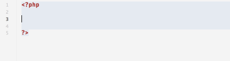

# WordPress.sugar for Espresso
This is a plugin for MacRabbit's [Espresso](http://macrabbit.com/espresso/) code editor with support for [WordPress](http://wordpress.org/).

## Features

### WordPress autocompletion
This Espresso plugin adds autocompletion and parameter hinting for all public functions in WordPress. Private and deprecated functions are excluded.

Start type the name of the desired function and press <kbd>tab</kbd> or <kbd>enter</kbd> to autocomplete the function.

Use <kbd>tab</kbd> and <kbd>shift</kbd>+<kbd>tab</kbd> to select the parameters. Optional parameters are wrapped in square brackets and can easily be deleted if not used.

### Look up function in WordPress Codex
Another handy feature is the ability to quickly look up a function in the WordPress Codex.

Simply place the cursor on a WordPress function and press <kbd>ctrl</kbd>+<kbd>h</kbd> to open the WordPress Codex in your browser. The action is also found in the actions menu.

This feature requires the [ShellActions sugar](https://github.com/onecrayon/ShellActions-sugar) to be installed.

## Installation
1. Download and extract the zip
2. Rename folder to WordPress.sugar
3. Double click the WordPress.sugar file to install it

## Data source
The WordPress data for this plugin is gathered using the api from [wpseek.com](http://wpseek.com/). I will do my best to keep the plugin updated with every major WordPress update.

Current version is using data from WordPress 4.7.